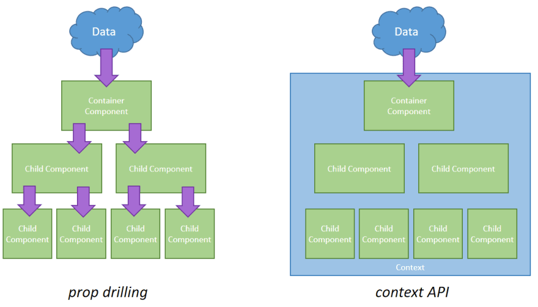

# todo-app
## LAB - Context API

## Author 

### **Dima Alabsi**

-----------------------------------
### Description 

***Phase 1 Requirements
In Phase 1, we’re going to perform some refactoring of the To Do application as built by another team. This application mixes application state and user settings at the top level and passes things around. It was a good proof of concept, but we need to make this production ready.***

Context provides a way to share values like these between components without having to explicitly pass a prop through every level of the tree.

Context is primarily used when some data needs to be accessible by many components at different nesting levels. Apply it sparingly because it makes component reuse more difficult.

Creates a Context object. When React renders a component that subscribes to this Context object it will read the current context value from the closest matching Provider above it in the tree.

The defaultValue argument is only used when a component does not have a matching Provider above it in the tree. This default value can be helpful for testing components in isolation without wrapping them. Note: passing undefined as a Provider value does not cause consuming components to use defaultValue.

useForm() 👍
allows us use state and other React features, like lifecycle methods, without writing a class.” ...  useForm() Hooks let us always use its functions instead of having to constantly switch between functions, classes, higher-order components, and render props

----------------------------

***[deploy URL using gh-pages](https://dimaalabsi.github.io/todo-app/)***

---------------------------------------------
 [context-settings pull request](https://github.com/DimaAlabsi/todo-app/pull/2)

------------------

### UML

